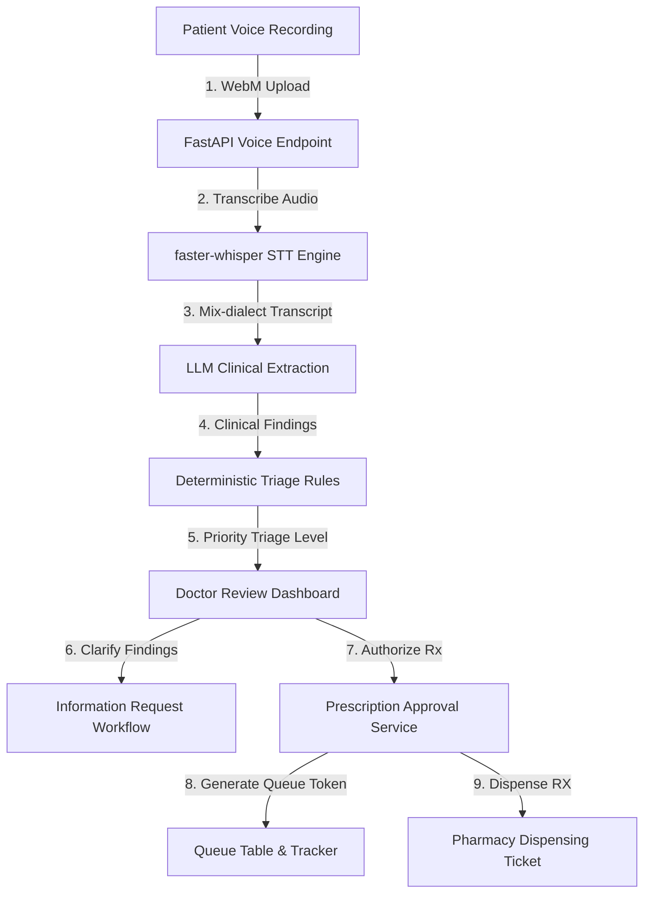

# RuralCare AI System Architecture

This document describes the architectural flow, component relationships, and database layer design of the **RuralCare AI** application.

---

## 1. System Flow Diagram

The diagram below outlines the E2E patient lifecycle from audio capture to pharmacy ticket dispensing:

---

## 2. Component Layout

### A. Frontend (React + Vite + TypeScript + Tailwind CSS)
- **Patient Registration Panel**: Captures basic details and starts the recording component.
- **Doctor Consultation Board**: Prioritizes patients by triage level (`EMERGENCY`, `URGENT`, `ROUTINE`), allows request of additional clinical information, and creates prescriptions.
- **Pharmacy Dashboard**: Lists doctor-approved queue tokens and handles prescription status tracking.

### B. Backend API Layer (FastAPI)
- **FastAPI routers**: Registered under `/api` in `main.py`.
- **transcribe.py**: Invokes `faster-whisper` for multilingual transcription.
- **llm.py & clinical_extraction.py**: Checks if Ollama is online with a 0.5s check, handles JSON parsing of clinical summaries, and falls back to demo mode if needed.
- **triage.py**: Deterministic priority rule engine based on clinical severity and key symptoms.

### C. Database & ORM Layer (Supabase PostgreSQL + SQLAlchemy)
- **Supabase Realtime**: Enables real-time synchronization of state updates (`cases`, `queue`, `pharmacy`, `prescriptions`).
- **SQLAlchemy ORM**: Maps core schemas (`Patient`, `Case`, `Prescription`, `Queue`, `Pharmacy`) to the Supabase database.
- **Table Synchronizer Pattern**: Writes to specific child tables (e.g. `voice_sessions`, `clinical_summaries`) and simultaneously updates parent columns in `cases` for frontend compatibility.

---

## 3. Database Schema Overview

The database contains 10 core tables:
1. `profiles`: Doctor and healthcare worker login identities.
2. `hospitals`: Hospital facilities and departments.
3. `patients`: Patient profiles containing basic health history.
4. `cases`: Central patient triage case records.
5. `voice_sessions`: Audio file references and transcription logs.
6. `clinical_summaries`: AI-extracted clinical findings and summary.
7. `prescriptions`: Doctor-drafted and approved prescription entries.
8. `queue`: Queue tokens for patient tracking.
9. `pharmacy`: Active prescription orders en route to the pharmacy.
10. `information_requests`: Doctor requests for additional triage metrics.

---

## 4. Clinical Safety Guarantees

1. **AI NEVER Prescribes**: Ollama/Qwen only extracts structured clinical findings. All prescription items are built and approved by the doctor.
2. **Deterministic Triage Rules**: The triage priority level is determined by python code rules checking specific clinical symptom indicators rather than letting the LLM invent them.
3. **Audit Log Trail**: Every lifecycle status transition (e.g. `CASE_CREATED`, `PRESCRIPTION_APPROVED`, `PHARMACY_DISPENSED`) triggers an immutable audit event in the `audit_logs` table.
